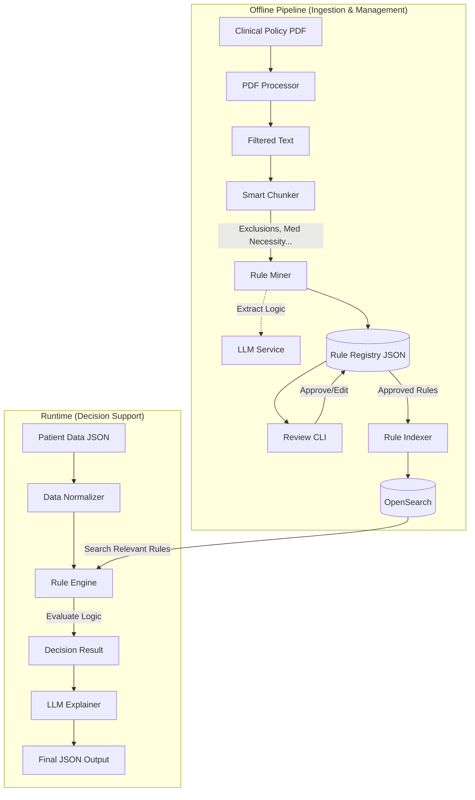

# Policy Matcher System Design

## Architecture Overview

The **Policy Matcher** system is designed to automate the evaluation of clinical policies against patient data. It consists of two distinct phases: an **Offline Ingestion Pipeline** and a **Runtime Decision Engine**.

## Key Components

### 1. Ingestion Pipeline (`src/policy_matcher/pipeline/`)
Responsible for transforming unstructured PDF policies into structured, computable rules.

*   **Ingestion (`ingestion.py`)**: 
    *   Extracts metadata (Effective Date, Version).
    *   Isolates the "Policy" section from the document.
*   **Smart Chunking**: 
    *   Splits text into numbered lists (e.g., "1.", "2(a)").
    *   Classifies chunks into types: **Eligibility**, **Medical Necessity**, **Exclusions**, **Documentation**.
*   **Rule Mining (`mining.py`)**: 
    *   Converts text chunks into "Candidate Rules".
    *   **Logic**: Uses `LLMInterface` to extract structured rules.
        *   `MockLLM`: Heuristic-based (Regex) for testing.
        *   `OpenAILLM`: GPT-4 based extraction of `rule_type` and `logic_expression`.
*   **Rule Registry (`registry.py`)**: 
    *   File-based storage (`data/rule_registry.json`) for managing Rule Lifecycle (`DRAFT` -> `APPROVED`).
*   **Review (`review.py`)**: 
    *   CLI tool for human-in-the-loop verification of draft rules.
*   **Indexing (`indexing.py`)**: 
    *   Indexes only `APPROVED` rules into OpenSearch.
    *   Uses `sentence-transformers` for vector embeddings.

### 2. Decision Runtime (`src/policy_matcher/main.py`)
Responsible for evaluating a specific patient case against the indexed rules.

*   **Rule Engine**: 
    *   Retrieves relevant rules from OpenSearch.
    *   Executes `logic_expression` against patient data.
    *   Handles `PEND` status for rules requiring manual review.
*   **LLM Integration (`src/policy_matcher/llm_utils.py`)**: 
    *   **Rule Extraction**: Extracts structured logic from policy text (Ingestion Phase).
    *   **Explainer**: Generates human-readable reasoning for decisions (Runtime Phase).
    *   Supports swappable backends (`MockLLM`, `OpenAILLM`).

## Data Flow
1.  **Ingest**: `run_pipeline.py` -> PDF processed into Draft Rules in Registry.
2.  **Review**: Human approves rules via CLI.
3.  **Index**: `run_indexing.py` -> Approved rules pushed to OpenSearch.
4.  **Evaluate**: `main.py` -> Patient data matched against indexed rules.
