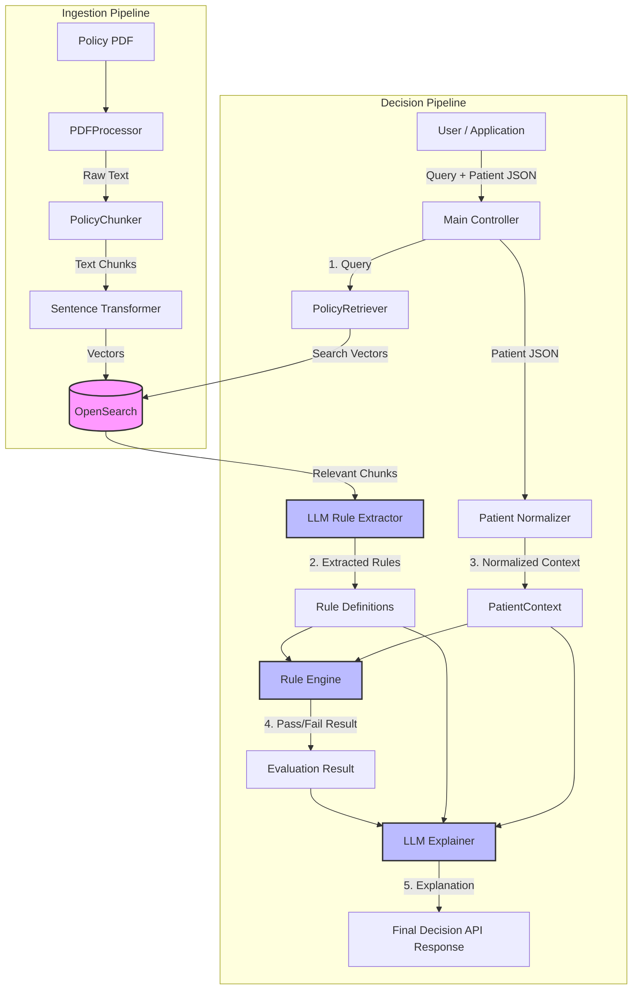

# System Design: Policy Matcher (Decision Support System)

This document outlines the architecture for the Policy Matcher system, a prototype for automating Prior Authorization (PA) decisions using policy documents and patient data.

## High-Level Architecture

The system is designed as a Retrieval-Augmented Generation (RAG) pipeline combined with a deterministic Rule Engine. It consists of two main workflows:
1. **Ingestion Pipeline**: Pre-processing policy documents into retrievable chunks.
2. **Decision Pipeline**: Evaluating patient data against policies to produce a decision with explanation.

### Diagram

## Component Details

### 1. Ingestion Layer
- **PDFProcessor (`ingestion.py`)**: Extracts raw text from PDF files. Future versions will handle structure (headers, tables).
- **PolicyChunker (`ingestion.py`)**: Splits text into logical units (e.g., paragraphs or list items).
- **PolicyRetriever (`ingestion.py`)**: Uses `opensearch-py` and `sentence-transformers` (all-MiniLM-L6-v2) to index chunk embeddings into OpenSearch.

### 2. Data Layer
- **Patient Processing (`patient.py`)**: Normalizes disparate patient inputs (JSON) into a standard `PatientContext` model using Pydantic. Handles standardization of codes (ICD-10, CPT) and strings.

### 3. Logic Layer
- **Rule Engine (`rules.py`)**: A deterministic engine that evaluates `Rule` objects against the `PatientContext`.
    - **Safety**: Uses a sandboxed `eval()` approach to execute logic expressions (e.g., `'M17.11' in diagnosis_codes`).
    - **Output**: Returns detailed pass/fail status for each rule and an overall decision (APPROVE, DENY, PEND).
- **LLM Integration (`llm_utils.py`)**:
    - **MockLLM**: Currently used for the prototype to simulate responses without API costs.
    - **Role**:
        1.  **Rule Extraction**: (Planned) Parsing text chunks into executable `Rule` objects.
        2.  **Explanation**: Generating human-readable rationale based on the Engine's structured results.

## Data Flow Example (Demo)

1. **Input**: "Eligibility for Knee Arthroplasty" + Patient Age 17.
2. **Retrieval**: System identifies chunks related to "Age requirements" and "Medical Necessity".
3. **Extraction**: LLM (simulated) creates Rule `R-EL-01`: `age >= 18`.
4. **Evaluation**: Engine checks `17 >= 18` -> **FAIL**.
5. **Result**: Decision="DENY", Evidence="Patient age is 17".
6. **Output**: JSON response with "DENY" and explanation.
